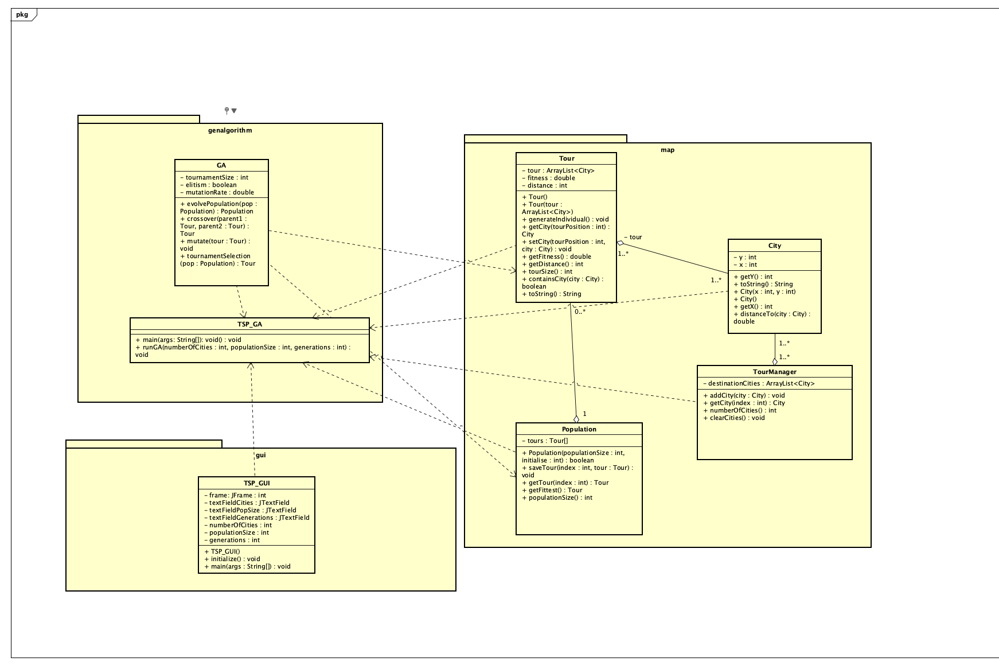

# OOLT.VN.20231-03

## Thành viên:

| Tên                            | Công việc                                                                                                |
| ------------------------------ | -------------------------------------------------------------------------------------------------------- |
| Nguyễn Thị Minh Châu 20214997  | **Leader**; Tạo lớp City, lớp Tour, lớp TourManagement, lớp Poppulation, lớp GA; Viết báo cáo; Làm slide |
| Nguyễn Thanh Nhật Bảo 20210096 | Vẽ general class diagram, detailed class diagram; Tạo lớp TSP_GUI, lớp TSP_GA                            |
| Võ Việt Bắc 20205055           | Vẽ general class diagram, usecase diagram                                                                |
| Nguyễn Minh Chiến 20215000     |                                                                                                          |

## Class diagram general:

## Class diagram detail:

## Usecase diagram:

## Demo:

- [DemoVideo](https://drive.google.com/file/d/1PJ7OV42aqrlJNOiboWZhE5AdJ8_X2NgN/view?usp=drive_link][DemoVideo)
